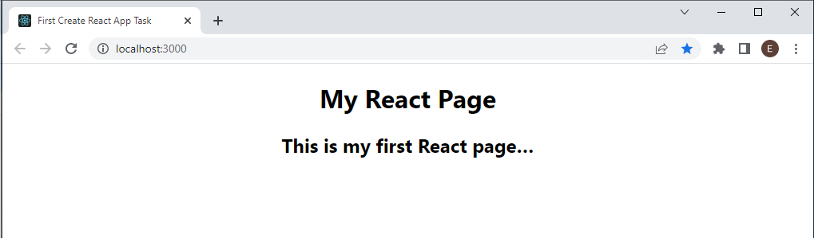
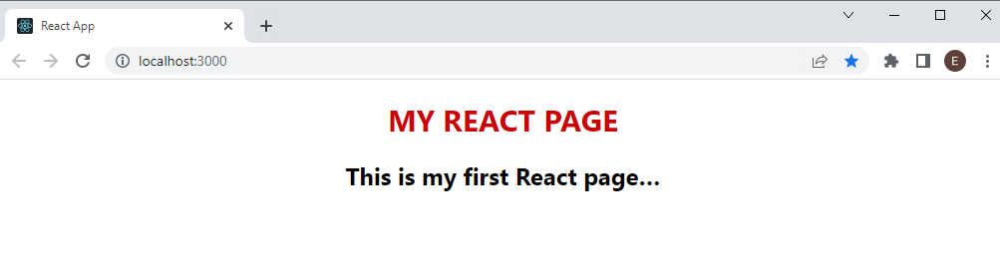

# First React App

Ensure you are in the correct directory. Your path should end in `/react-starter-files/first-react-app` e.g.

```shell
pwd
/react-starter-files/first-react-app
```

## NPM and Node.js Versions

To run the `create-react-app` you’ll need to have `Node >= 14.0.0` and `npm >= 5.6` on your machine. 

To check your node.js version run the following command:

```shell
node -v
```

To check your npm version run the following command:

```shell
npm -v
```

[Update to the latest stable versions of Node](https://nodejs.org/en/) if you Node version is **earlier** than **14.0.0**.

Once the code is successfully installed, you will have a simple React single page application.

## Create React App

Run the following commands to create and start the react app in the current directory

```shell
npx create-react-app .
npm run start
```

## Task: Create React App

1. Open the [index.html](./public/index.html) file under the **public** folder and change the title tag to **"First Create React App Task"**.

1. Open the [App.css](./src/App.css) file under the **src** folder and change the application background colour.

1. Make other cosmetic (look-and-feel only) changes to the [App.css](./src/App.css) file and review the changes in your browser

1. Open [App.js](./src/App.js). Review the main function called `App()`. The return statement outputs what looks like HTML elements e.g. ``, `<a>`, `<p>` tags 

1. Change the return statement to output new '**HTML**' elements, e.g.

``` HTML
<div className="App">
  <h1>My React Page</h1>
  <h2>This is my first React page…</h2>
</div>
```



6. Create a style variable for your new `<h1>` element in [App.js](./src/App.js). <br/><br/>**For more information on styling react elements, read [the React help pages][1]**

1. Create a variable called `h1Style`. The attributes of the style object are similar to CSS class attributes but using camelCase:

```JavaScript
const h1Style = { 
  "fontSize":"30px",
  "color": "#cc0000",
  "textTransform": "uppercase"
};
```
8. Connect the new style object to your `<h1>` element. 



[1]:(https://reactjs.org/docs/dom-elements.html#style)

9. Open  [App.css](./src/App.css) and add a class called `.bio`.

1. Add a className property to the `<h2>` element in the [App.js](./src/App.js) file.

```JavaScript
className = "bio"
```

11. Add a short paragraph of text, e.g. _This is my first react page. I created it on …_.

## Task: Testing the Create React App

1. Visit the page https://create-react-app.dev/docs/running-tests for more information about Jest and running tests

1. Open the project in the first-react-app folder

1. Replace the existing test with the following code snippet to the test file [App.test.js](\src\app.test.js)

```JS
it('renders without crashing', () => {
  const root = ReactDOM.createRoot(document.createElement('div'));
  root.render(<App />,root);
});
```

3. The test script will fail with a __ReferenceError__ as the `ReactDOM` is not referenced

1. Add a reference to the `ReactDOM` and run the test again. What are the results?

1. Add tests to check that the `<h1>` and `<h2>` elements are render on the page

1. Add a test to check that the text "__My React Page__" can be found on the page.
