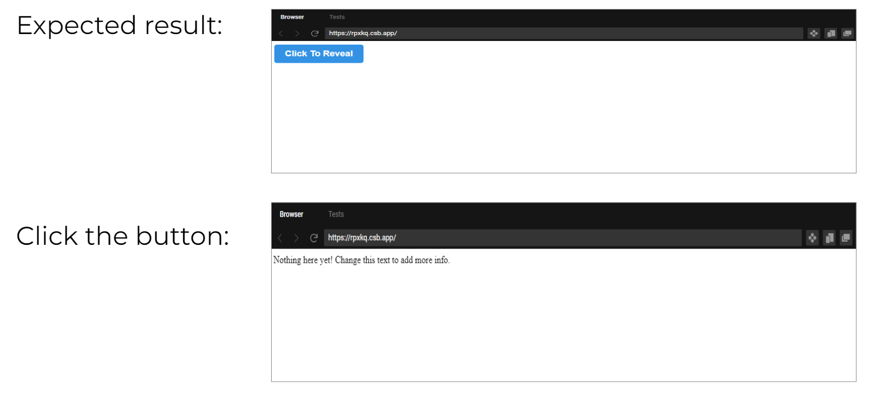
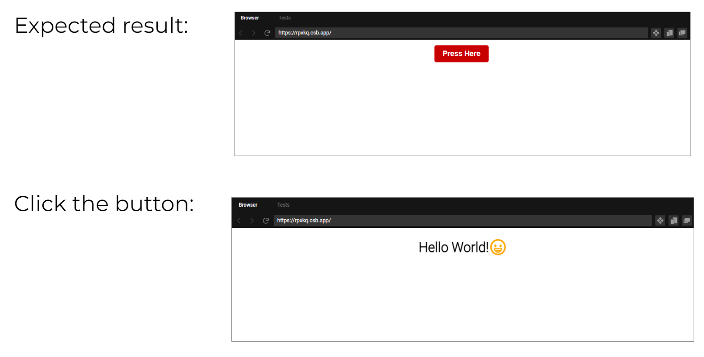

# React

## Task 1: Adding React to a Web Page

### Starter Files Task 1 and 2:

```
- react-webpage
    |-- index.html
    |-- index.js
```
### Steps:

- Add a React element to your HTML page.
- Follow the steps below to add the React library and a button element to a HTML page.

### 1. Edit the index.html:

- Add the following script tags to the [**index.html**](index.html) file:

```html
<script src="https://unpkg.com/react@latest/umd/react.development.js" crossorigin></script>
<script src="https://unpkg.com/react-dom@latest/umd/react-dom.development.js" crossorigin></script>
<script type="text/javascript" src="index.js"></script>
```

### 2. Edit the index.js:

- Add the following code to the [**index.js**](index.js) file:

```javascript
'use strict';

function ClickableButton() {

  const [clicked, setClick] = React.useState(false);

  if (clicked) {
    return 'Nothing here yet! Change this text to add more info.';
  }

  return React.createElement(
    'button', {
    style: {
      backgroundColor: "#3392e4",
      color: "#fff",
      border: "0",
      padding: "10px 20px",
      fontWeight: "bold",
      borderRadius: "5px",
      fontSize: "1.1em"
    },
    onClick: () => setClick(true)
  },
    'Click To Reveal'
  );
}

const root = ReactDOM.createRoot(document.querySelector('#root'));
root.render(React.createElement(ClickableButton));
```

### 3. Run the code in a browser

1. Open the [**index.html**](index.html) file in [Live Server][1] to test the code is working.
1. What do you think is happening? Investigate and try and understand the code.

#### What's Happening?

### 4.  Refactor the Code

Refactor (improve) the code by adding [an external CSS][2] file instead of using inline CSS style attributes:

  1. Create a CSS file called `style.css` and add a `<link>` element in your index.html that connects to the `style.css`.
  1. Add a CSS class called `.main-button` to `style.css`
  1. Move the inline style attributes from the button code in `index.js` to the `.main-button` class in `style.css` 

**Note:** The style attribute names will need to change from **CamelCase** to **kebab-case** _AND_ the attributes will need to be changed from JSON attribute to CSS attributes**



## Task 2: Editing a React Web Page

1. Change the text in the button to _'Press Here'_ from _'Click to Reveal'_ (Hint: this can be done in the `index.js` file).

1. Change the text that is revealed after you click the button to `'Hello World!'`.

1. Change the look of the button by changing the `.main-button` class in `styles.css`. Make the button colour red and centre it on the page. 

1. Change the text displayed when the button is clicked to return a `<h1>` element. Use a nested `React.createElement()` in the if-statement, e.g.

```javascript
if (clicked) {
    return React.createElement('h1',.....);
 }
```

5. Add a `style` or `className` attribute to the returned `<h1>` element and change it's colour, size and and or boldness.



## __Bonus Task:__ Build a Simple GUI

6. Recreate the example interface below using the `React.createElement()` call. <br><br>*NB: You only need to implement the look-and-feel of the interface not the functionality. 
<br/><br>If you finish the implementing the GUI feel free to start adding some basic functionality, e.g. click the add button and increment the shopping basket number*


You can find the images in the [imgs](/imgs) folder.

[1]:https://marketplace.visualstudio.com/items?itemName=ritwickdey.LiveServer
[2]:https://developer.mozilla.org/en-US/docs/Learn/CSS/First_steps/Getting_started