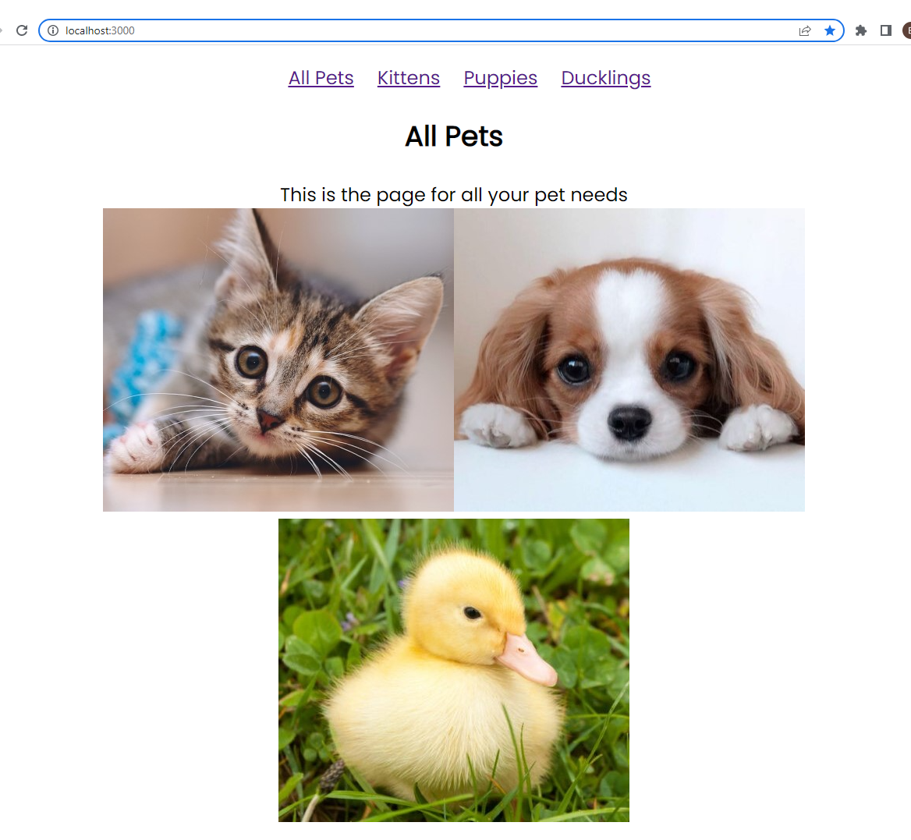
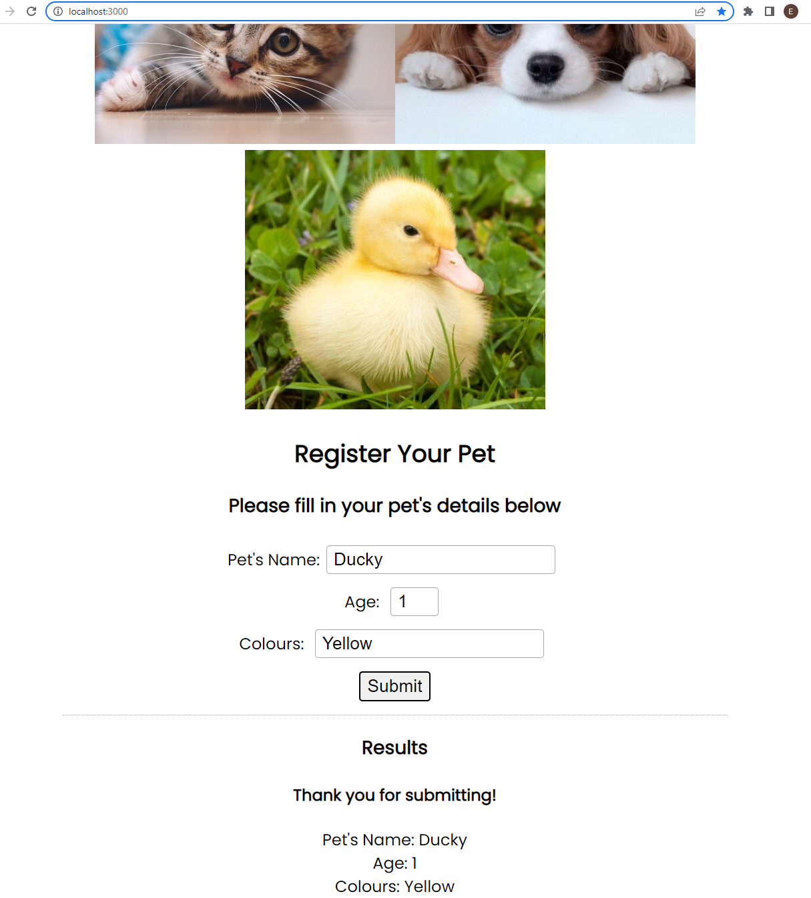

# Routes and Forms

## Task: Adding Routes

1. Open the [routes-and-pages][1] folder. In the [index.js][2] there are two routes defined, `Home` and `Kittens`

1. Each route has a `<Link/>` component defined

1. Run the `npm install` command from the terminal to install the project dependencies. Run `npm start` to start the project

1. Create `<Puppies/>` and `<Ducklings/>` functional component. Use the `<Kittens/>` component as an example 

1. Add another two routes called `<Puppies/>` and `<Ducklings/>` to the [index.js][2]

1. When complete, navigating to __localhost:3000/*puppies*__ or __localhost:3000/*ducklings*__ will take you to the two new component views you created

1. Add a Link for the `<Puppies/>` view and to the `<Ducklings/>` view to enable users to navigate to the components using  breadcrumb links

1. Ensure the new component returns a short __description__ and __image__, e.g. the Kitten component

1. When complete, you should be able to navigate between the components using links in the breadcrumb



## Task 2: Building a Form

1. In Visual Code open the [routes-and-forms][1] folder

1. The [PetForm.js][2] file now contains the code for a [__controlled component__][4].

1. Add the `<PetForm/>` component as a child component of the `<Home/>` component in the [index.js][2] file.

1. Run the project using the `npm start` command to test the functionality

1. The form contains a __name__ field which is a __controlled component__. Add an __age__ and a __colours__ form field as __controlled components__:

```XML
<label>Age: <input type="number"/></label>
<label>Colours: <input type="text"/></label>
```

6. Ensure the state (value) of the elements are updated when the details are entered into the form fields

1. Display the submitted values on the page in the results section

1. Use a React.Fragment or short syntax (`<></>`) instead of a `<div>` to encapsulate the form

1. Add a message "__*Thank you for submitting*__" to the output displayed in the `<div></div>` whenever the form is submitted

1. Ensure the message "__*Thank you for submitting*__" is removed whenever the user changes an input field. <br/><br/>*Hint: add a React Hook that sets a variable when the form is submitted, e.g:*
```js
const [hasSumitted, setSubmitted] = useState(false);
```
11. Conditionally display "__*Thank you for submitting*__" depending on if `hasSumitted` is true or false



[1]:/routes-and-forms/
[2]:/routes-and-forms/src/index.js
[3]:/routes-and-forms/src/components/PetForm.js
[4]:https://reactjs.org/docs/forms.html
